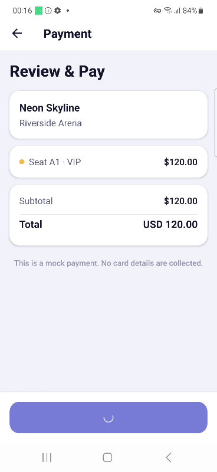

# Ticket 4 — VIP payment remains processing

**Finding:** After tapping Pay Now for Neon Skyline VIP seat A1 ($120, no discount), Encore remains on Review & Pay with a processing spinner for the full 30-second wait; checkout does not reach confirmation during the observed interval.

| Submission field | Recommended answer |
| --- | --- |
| Classification | App Bug |
| Severity | Critical |
| Call | Block the release until it's resolved |

These are evidence-based recommendations, not an organizer answer key. A core paid booking path cannot finish for the observed VIP selection, with no visible failure message or verified recovery. Choosing a different tier does not fulfill the requested VIP purchase. We have not established that all VIP seats, all devices, or all bookings fail.

## Reproduction and environment

- Frozen official encore-release.apk v1.0.0, package com.hackathonqa.encore.
- Samsung Galaxy S23, Android 13.0; original supplied Python/Appium test run through Test Companion and BrowserStack SDK.
- Session started September 25, 2026, 01:14:51 BST (00:14:51 UTC).
- Guest entry → Neon Skyline (evt-01) → Select Seat → VIP A1 → Continue → skip discount → Pay Now.
- The PRD says payment is mocked, collects no card details and invokes no external processor. Payment should finalize the booking and display confirmation immediately afterward. [PRD](https://github.com/pujagani/encore-test-suite/blob/main/PRD.md)

**Expected:** The mock payment resolves and Booking Confirmation appears with the selected seat.

**Actual:** The app shows Review & Pay, seat A1 · VIP, total USD 120.00, and a spinning disabled-looking payment button. No visible error or confirmation appears in the captured failure frame. The processing indicator remains displayed through the final log polls.

## Evidence

- [Public failing session and video](https://app-automate.browserstack.com/projects/Encore+Hackathon/builds/Encore+Hackathon+Ticket/4?tab=sessions&public_token=6cf685aea634b4e545fb43be189adc6ff942e0be217c6e85ca9a4b927dbc4e20&details=19bc316e8a3917fc908fa2ef7e19e598288a293a) — verified in a fresh Chrome Incognito window with Sign in and public view-only indicators. Video and logs loaded without authentication.
- [Original supplied test](../../python/tests/test_vip_booking_payment.py) — unchanged; SHA-256 `105aba2d15e0ed9028bdd07ae6c616d85fc0f7e50a23b1b49c2df447f6496275`.
- [Actual app frame at video timestamp 01:00](vip-payment-at-60s.png), extracted without altering content from the original BrowserStack recording. The timestamp is video elapsed time, not an additional 60-second payment wait.
- [RCA review](rca-review.md) — records the automatic diagnosis and our critical assessment.
- **Attachment still required before final submission:** save the actual Test Companion Failure Analysis/RCA screenshot. It was displayed and captured in the assistant conversation, but an image file has not yet been added here. Do not mark the ticket's evidence package fully complete until this is attached.

## Failure mechanism and limits

Pay Now was located and clicked successfully. Appium repeatedly found `payment-processing-indicator` and returned `displayed=true`, including the final 00:57–00:59 log entries. The supplied test failed at line 57 waiting for that indicator to become invisible (30-second timeout). Its subsequent confirmation-screen wait was **not executed** because the first wait raised. `driver.quit()` then closed the session; CLIENT_STOPPED_SESSION is that cleanup, not the cause of payment failure.

BrowserStack reports one failed test; the raw Appium session is Unmarked because no explicit session status was assigned. These two statuses are not contradictory.

The screenshot and successful preceding interactions support an app-side payment hang rather than a locator or navigation failure. The specific implementation cause remains unconfirmed. A single bounded observation cannot prove an infinite hang. No same-device Standard-seat control or repeat run has been performed for this ticket.

## Triage decision

Preserve the failing regression test. Investigate the VIP-specific mock payment completion/error path and guarantee a terminal success or recoverable error state. Do not increase the timeout, remove the confirmation expectation, or bundle an unrelated native library merely to make automation green. Re-run the original test after a product fix, alongside Standard and mixed-tier controls.

The team submission form has not been submitted.
